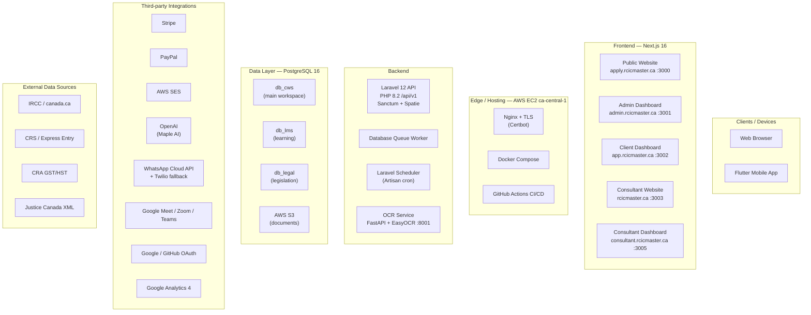

# RCICMaster (WayToCanada) — System Architecture Diagram Prompt

Copy **everything below the line** into ChatGPT (or Claude / Gemini) to generate a full, polished high-level System Architecture Diagram.

---

CHATGPT PROMPT (copy everything below this line to ChatGPT):
================================================================================
Create a complete, professional **High-Level System Architecture Diagram** for **RCICMaster** (also known as WayToCanada) — a multi-tenant Canadian immigration consultant platform (RCIC practice management).

## Output requirements

1. Draw ONE full system architecture diagram (not an ERD, not a class diagram).
2. Prefer a clean layered / C4-container style layout:
   - Top → Clients / Users
   - Then → Frontend apps
   - Then → Edge / reverse proxy
   - Then → Backend API + workers
   - Then → Data stores
   - Sides / bottom → Third-party integrations & external data sources
3. Use clear boxes, arrows with labels (HTTP/HTTPS, Bearer token, webhook, queue, cron, S3 API, etc.).
4. Color-code layers consistently (suggested):
   - Clients / devices — light blue
   - Frontends — teal / cyan
   - Edge / hosting — gray
   - Backend — indigo / purple
   - Databases — orange
   - Storage / queues — yellow
   - Third-party SaaS — green
   - External government data — brown / olive
5. Output as: Mermaid `flowchart TB` or `C4Container` **AND** a short legend + request-flow notes.
6. Keep labels readable; group related services inside subgraphs / clusters.
7. Title the diagram: **RCICMaster — High-Level System Architecture**

## Product summary

RCICMaster is an immigration practice platform where:
- **Applicants / clients** apply, complete questionnaires, upload documents, sign retainers, pay fees, attend meetings, and use LMS.
- **RCIC consultants** manage clients/cases, use Maple AI advisor, legislation tools, letters, marketing, storage, billing, and community.
- **Platform admins** manage users, packages, gateways, integrations, LMS, legislation sync, WhatsApp inbox, support, and settings.
- One **Laravel API** serves five Next.js web apps + a Flutter mobile app.
- Production runs on a **single AWS EC2** host (ca-central-1) with Docker + Nginx + Let's Encrypt.

Primary domains (production):
- `rcicmaster.ca` / `www` — Consultant marketing website
- `consultant.rcicmaster.ca` — Consultant dashboard
- `apply.rcicmaster.ca` — Public applicant website
- `app.rcicmaster.ca` — Client / applicant dashboard
- `admin.rcicmaster.ca` — Platform admin dashboard
- API behind same host Nginx → Laravel on port `8000` (`/api/v1`)

---

## LAYER 1 — Clients / Actors

| Actor | How they access |
|---|---|
| Public visitors / applicants | Browser → Public website + Client dashboard |
| RCIC consultants | Browser → Consultant website + Consultant dashboard |
| Platform admins | Browser → Admin dashboard |
| Mobile users | Flutter app (`rcicmaster_mobile`) → same Laravel API |

---

## LAYER 2 — Frontend applications

All web frontends: **Next.js 16 + React 19 + TypeScript + Tailwind CSS 4** (Radix/shadcn, Zustand, Zod).

| App | Role | Production host | Local port |
|---|---|---|---|
| Public website | Marketing + auth entry for applicants | `apply.rcicmaster.ca` | 3000 |
| Admin dashboard | Platform administration | `admin.rcicmaster.ca` | 3001 |
| Client (public users) dashboard | Applicant workspace | `app.rcicmaster.ca` | 3002 |
| Consultant website | Marketing + login/register for RCICs | `rcicmaster.ca` / `www` | 3003 |
| Consultant dashboard | RCIC practice workspace | `consultant.rcicmaster.ca` | 3005 |
| Flutter mobile | Native client/consultant/admin features | App stores / device | — |

Frontend → API:
- Base URL: `NEXT_PUBLIC_API_URL` + `/api/v1`
- Auth: Laravel Sanctum bearer tokens (`Authorization: Bearer …`)
- Optional: `NEXT_PUBLIC_OCR_URL`, `NEXT_PUBLIC_GA_KEY` (GA4)

---

## LAYER 3 — Edge / Cloud hosting

**Cloud:** AWS EC2 (Ubuntu 24.04), region **ca-central-1**  
**App path on server:** `/opt/waytocanada`  
**Orchestration:** Docker Compose (prod)  
**TLS:** Certbot / Let's Encrypt  
**Reverse proxy:** Host **Nginx** (`deploy/nginx/rcicmaster.conf`)

Nginx routes:
- Subdomains → Next.js containers (`:3000`, `:3001`, `:3002`, `:3003`, `:3005`)
- API traffic → Laravel API container (`:8000`)
- Optional OCR service → FastAPI (`:8001`)

**CI/CD:**
- GitHub Actions `ci.yml` — Laravel tests + PostgreSQL 16
- GitHub Actions `deploy.yml` — SSH to EC2 → `git reset --hard` → `deploy/deploy-on-server.sh`

Show in diagram:
`GitHub → GitHub Actions → SSH deploy → EC2 (Docker + Nginx)`

---

## LAYER 4 — Backend API & async processing

### Core API
- **Laravel 12 / PHP 8.2**
- Prefix: `/api/v1`
- Health: `/up`
- Auth: **Laravel Sanctum** (+ Spatie Permission roles: `super-admin`, `admin`, `rcic`, clients as authenticated users)
- Social login: **Google OAuth**, **GitHub OAuth** (Socialite)
- CORS + `SANCTUM_STATEFUL_DOMAINS` for multi-origin Next apps

Key backend areas (group as one API box with internal labels is fine):
- Auth & roles
- Clients / cases / questionnaires / documents
- Retainers & PDFs (DomPDF)
- Payments (Stripe / PayPal webhooks)
- Storage addons
- Meetings (Google Meet / Zoom / Teams)
- Notifications
- WhatsApp inbox/webhooks
- LMS
- Maple AI workspace advisor
- Legislation hub
- IRCC news/forms, CRS, GST/HST sync commands

### Async / workers (no product WebSockets)
- **Queue:** `QUEUE_CONNECTION=database` (jobs table)
- Example jobs: notifications delivery, legislation sync batches
- **Scheduler** (America/Toronto), via host crontab `* * * * * php artisan schedule:run`:
  - Daily — `ircc:fetch-news`
  - 03:00 — `ircc:sync-forms`
  - 04:00 — `crs:sync`
  - 05:00 — `legislation:sync`
  - 06:30 — `gst-hst:sync`
  - 09:00 — `agreements:send-reminders`
  - 09:30 — `payments:send-reminders`
  - Every 15 min — `meetings:send-reminders`
- Broadcast: `BROADCAST_CONNECTION=log` (no Echo/Reverb/Pusher realtime channel)

### OCR microservice
- **FastAPI + EasyOCR** (`ai-service`, port **8001**)
- Laravel proxies document scan: `POST /documents/scan` → OCR service

---

## LAYER 5 — Databases & storage

### PostgreSQL 16 — three logical databases (Eloquent)

| Connection | Database | Purpose |
|---|---|---|
| `cws` (default) | `db_cws` | Users, auth, cases, payments, community, IRCC catalog, Maple AI chats, etc. |
| `lms` | `db_lms` | Courses, lessons, quizzes, homework, assignments |
| `legal` | `db_legal` | Legislation hub / IRPA–IRPR research corpus |

Note: LMS assignments reference `users.id` logically across DBs (no physical FK).

### Object storage
- **AWS S3** (`ca-central-1`) — documents, uploads
- Dev: **LocalStack** S3 (`:4566`, bucket `waytocanada-docs`)

### Cache / queue note
- Default cache/queue in example env: **database** driver
- Redis config exists but is not the primary production queue/cache in the example setup

---

## LAYER 6 — Third-party integrations

Group these around the Laravel API with labeled arrows:

| Category | Services |
|---|---|
| Payments | **Stripe** (Checkout, subscriptions, Connect, webhooks, tax helpers); **PayPal** (subscriptions + webhooks); Interac noted in consultant settings |
| Email | **AWS SES** (preferred, PIPEDA-friendly); SMTP fallback |
| AI | **OpenAI** Chat Completions (`gpt-4o-mini` defaults) — Maple advisor, letter generation, legislation analyze/linkify |
| OCR | FastAPI EasyOCR service |
| File storage | **AWS S3** |
| Social auth | Google, GitHub |
| Messaging | **Meta WhatsApp Cloud API** (primary) + **Twilio WhatsApp** (fallback) |
| Meetings | Google Meet/Calendar, Zoom, Microsoft Teams OAuth |
| Analytics | Google Analytics 4 (`react-ga4`) |
| PDF | DomPDF on backend; pdf.js / mammoth on frontends |

Gateway credentials may live in DB (`PaymentGatewaySetting`, `IntegrationSetting`) as well as env.

---

## LAYER 7 — External data sources (scheduled sync)

Show as inbound sync arrows into Laravel scheduler / jobs:
- IRCC / canada.ca — news & forms
- Express Entry / CRS draws
- CRA GST/HST rate pages
- Justice Canada legislation XML

---

## How components connect (must show these flows)

### A) Normal authenticated request
```
Browser / Flutter
  → Nginx (TLS)
    → Next.js frontend OR Flutter directly to API
      → Laravel /api/v1 (Bearer Sanctum token)
        → PostgreSQL (cws | lms | legal)
        and/or → S3 / OpenAI / WhatsApp / Stripe / etc.
```

### B) Login / OAuth
```
Frontend → POST /api/v1/auth/login
  OR OAuth redirect (Google/GitHub)
    → Sanctum personal access token
      → stored client-side → used on subsequent API calls
```

### C) Document / OCR flow
```
Client uploads document
  → Laravel stores to S3
  → Laravel proxies scan to OCR FastAPI (:8001)
  → text/result returned for questionnaire / review
```

### D) Billing flow
```
Admin configures Stripe/PayPal in DB
  → Consultant subscribe OR client payment request
    → Checkout / PayPal
      → Webhook → Laravel fulfillment services
```

### E) Maple AI flow
```
Consultant workspace
  → Laravel Maple/workspace AI services
    → OpenAI (or rules fallback if disabled)
```

### F) Async notifications / reminders
```
Event in API
  → Job queued (database queue)
    → worker processes DeliverNotificationChannelsJob
      → in-app + SES email + WhatsApp
Scheduler also fires reminder Artisan commands
```

---

## Suggested Mermaid structure (implement fully, expand labels)

Use subgraphs roughly like this (fill with all real nodes from this prompt):



Complete the Mermaid so every major node is connected. Do not leave the stub empty.

---

## Legend to include under the diagram

- Solid arrow = synchronous HTTPS/API call  
- Dashed arrow = webhook / async / cron / sync job  
- Dotted arrow = deploy / CI pipeline  
- Bearer = Sanctum token auth  

## Extra notes to print under the diagram (short)

1. Five Next.js portals + Flutter share one Laravel API.  
2. PostgreSQL is split into `db_cws`, `db_lms`, `db_legal`.  
3. Async work uses Laravel **database queues** + scheduled Artisan commands — **no first-party WebSocket realtime layer**.  
4. Production = single EC2 in **ca-central-1** with Dockerized services behind Nginx.  
5. Document intelligence = EasyOCR microservice + OpenAI “Maple” advisor.

## Style

- Professional SaaS architecture poster look
- Minimal clutter, strong grouping, readable fonts
- Landscape orientation preferred
- Suitable for stakeholder / pitch / technical onboarding slides

Now generate the **full diagram** (complete Mermaid code) plus a 1-paragraph architecture narrative.
================================================================================
