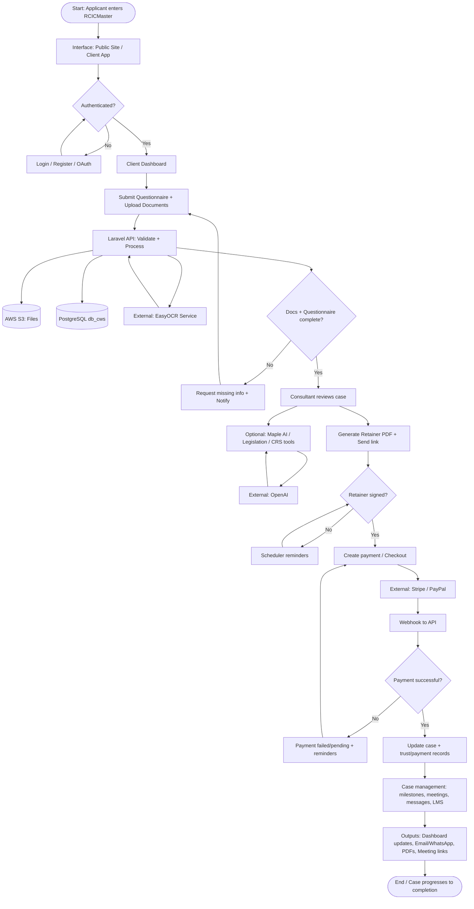

# RCICMaster (WayToCanada) — High-Level System Flow / Overview Diagram Prompt

Copy **everything below the line** into ChatGPT (or Claude / Gemini) to generate a clear, high-level **System Flow / Overview Diagram**.

This is **NOT** a detailed Data Flow Diagram (DFD), ERD, or class diagram.  
It should show how **data / process flows from start to end** inside the system at a stakeholder-friendly level.

---

CHATGPT PROMPT (copy everything below this line to ChatGPT):
================================================================================
Create a complete, professional **High-Level System Flow / Overview Diagram** for **RCICMaster** (WayToCanada) — a Canadian immigration consultant (RCIC) practice management platform.

## What this diagram must do

Show how the **main business process flows from start to finish** inside the system:
Trigger → Interface → API / Business Logic → (optional External APIs) → Database → Output to User

Keep it **high-level** (overview), not a deep technical DFD. Use a **flowchart structure** with arrows.

## Output requirements

1. Draw ONE primary end-to-end flow for the **core immigration case journey**, plus smaller side flows for important supporting paths (auth, payment, AI, OCR) — either as swimlanes or as linked sub-flows on the same poster.
2. Use flowchart shapes:
   - Rounded rectangles = start / end
   - Rectangles = process steps
   - Diamonds = decisions (Yes/No)
   - Parallelograms or cylinders = data storage
   - Hexagons or cloud shapes = external services (optional)
3. Every major arrow should be labeled briefly (e.g., Submit, Validate, Save, Webhook, Notify).
4. Color-code by stage (suggested):
   - Trigger / Entry — light blue
   - Interface / Web App — teal
   - Process / Business Logic — indigo
   - Decision — amber / yellow
   - Database — orange
   - External API — green
   - Output / End — soft green or gray
5. Output as **Mermaid flowchart** (`flowchart TD` or `flowchart LR`) **AND** a short legend + 1-paragraph narrative.
6. Title: **RCICMaster — High-Level System Flow / Overview**
7. Landscape layout preferred; readable for slides / onboarding docs.

## Required building blocks (must appear)

### 1) Trigger / Entry Point
Examples that must be covered in the main journey:
- Applicant registers / logs in
- Applicant submits questionnaire / uploads documents
- Consultant starts case review
- Client pays retainer / milestone
- System cron / webhook triggers (reminders, payment success)

### 2) Process Blocks
Show high-level processing steps such as:
- Validation
- Authentication / Authorization
- Document processing / OCR
- Pathway / CRS assessment support
- Retainer generation / e-sign
- Case status updates
- Notification dispatch
- AI advisor (Maple) request handling
- Payment fulfillment

### 3) Data Storage Interactions
Show read/write to:
- PostgreSQL `db_cws` (users, cases, payments, questionnaires, etc.)
- PostgreSQL `db_lms` (learning content / assignments) — side note if LMS touched
- PostgreSQL `db_legal` (legislation corpus) — for legislation/AI assist side flow
- AWS S3 (document files)

### 4) Decision / Conditional Logic Points
Must include Yes/No diamonds for at least:
- Is user authenticated / authorized?
- Are required documents / questionnaire complete?
- Is retainer signed?
- Is payment successful?
- Is OCR / AI service available? (optional fallback path)

### 5) Output / End Point
Examples:
- Dashboard update
- Notification (in-app / email / WhatsApp)
- PDF generated (retainer / invoice)
- Payment confirmation
- Case status moved to next stage
- Maple AI answer shown to consultant

---

## Preferred flow skeleton (expand this fully with RCICMaster specifics)

Use this pattern as the backbone (do not leave it abstract — fill with real product steps):

```
[ User Input / Trigger ]
           │
           ▼
[ Interface / Web App ]
           │
           ▼
[ API / Business Logic Process ] ──► [ External API (Optional) ]
           │                                   │
  (Read/Write Data)                     (Return Data)
           ▼                                   │
  [ Database Storage ] ◄───────────────────────┘
           │
           ▼
[ Output / Response to User ]
```

---

## Product context (use these real platform pieces)

### Actors
- **Applicant / Client** — applies, fills questionnaire, uploads docs, signs retainer, pays, learns via LMS
- **RCIC Consultant** — reviews clients/cases, pathway tools, Maple AI, letters, meetings, billing
- **Platform Admin** — packages, gateways, integrations, sync jobs, support
- **System** — cron scheduler + webhooks (Stripe/PayPal/WhatsApp)

### Interfaces (entry points)
- Public website (`apply.rcicmaster.ca`)
- Client dashboard (`app.rcicmaster.ca`)
- Consultant website (`rcicmaster.ca`)
- Consultant dashboard (`consultant.rcicmaster.ca`)
- Admin dashboard (`admin.rcicmaster.ca`)
- Flutter mobile app
- External webhooks (Stripe, PayPal, WhatsApp)

### Central process engine
- Laravel 12 API (`/api/v1`) with Sanctum auth + role checks
- Database queue workers + Laravel scheduler (reminders / IRCC / CRS / legislation / GST-HST sync)

### External services used in flows
- Stripe / PayPal (payments)
- AWS S3 (files)
- AWS SES (email)
- OpenAI (Maple AI, letters, legislation assist)
- FastAPI EasyOCR (document scan)
- Meta WhatsApp Cloud API / Twilio WhatsApp
- Google Meet / Zoom / Teams (meetings)
- Google / GitHub OAuth (login)

---

## PRIMARY FLOW TO DRAW (Core Case Journey — mandatory)

Draw this as the main vertical / left-to-right flow:

1. **Start:** Applicant visits public site / opens app → Register or Login  
2. **Auth decision:** Credentials / OAuth valid?  
   - No → error / retry  
   - Yes → Sanctum token → Client dashboard  
3. **Choose / connect consultant** (if needed)  
4. **Submit questionnaire + upload documents** (Client dashboard)  
5. **API validates input**  
6. **Store metadata in `db_cws` + files in S3**  
7. **Optional OCR:** send document to OCR service → return extracted text → save/use in review  
8. **Decision:** Questionnaire & docs complete?  
   - No → prompt client for missing items + notify  
   - Yes → notify consultant / move case toward assessment  
9. **Consultant reviews case** (Consultant dashboard)  
10. **Pathway / assessment support** (CRS tools, legislation lookup, Maple AI optional)  
11. **Generate retainer agreement (PDF)** → send secure token link to client  
12. **Decision:** Client signed retainer?  
    - No → reminder (scheduler / notifications)  
    - Yes → case proceeds  
13. **Create payment request / checkout** (Stripe or PayPal)  
14. **Decision:** Payment successful (webhook)?  
    - No → failed/pending path + reminder  
    - Yes → update payment / trust / case status in DB  
15. **Case management continues** (milestones, meetings, messages, forms, LMS if assigned)  
16. **Outputs along the way:** dashboard updates, email/WhatsApp notifications, PDFs, meeting links  
17. **End (high-level):** Case progresses through lifecycle statuses toward completion / closed

Case lifecycle hint (optional status labels on the flow):  
`PENDING_ASSESSMENT` → review / retainer / payment → active case management → completed/closed

---

## SUPPORTING FLOWS (include as smaller connected swimlanes or side panels)

### A) Login / Auth Flow
Trigger: User submits login or clicks Google/GitHub  
→ Frontend  
→ Laravel Auth  
→ Decision: valid?  
→ Write/read user + token (`db_cws`)  
→ Output: redirect to role dashboard (client / consultant / admin)

### B) Payment Webhook Flow
Trigger: Stripe/PayPal webhook  
→ Laravel webhook handler  
→ Verify event  
→ Decision: success?  
→ Update subscription / payment / invoice records  
→ Queue notification job  
→ Output: confirmation on dashboard + email/WhatsApp

### C) Document OCR Flow
Trigger: User uploads document  
→ API stores file in S3  
→ API calls OCR FastAPI  
→ Decision: OCR OK?  
→ Save/return extracted content  
→ Output: text available in questionnaire/review UI

### D) Maple AI Advisor Flow
Trigger: Consultant asks Maple in workspace  
→ Laravel workspace AI service  
→ OpenAI (or rules fallback if disabled)  
→ Optional read from case / legal context  
→ Output: AI advice shown in consultant UI

### E) Reminder / Scheduler Flow
Trigger: Cron (`schedule:run`)  
→ Artisan commands (agreement/payment/meeting reminders, IRCC/CRS/legislation/GST sync)  
→ Read DB → send notifications / update catalogs  
→ Output: reminders delivered or synced data available in dashboards

---

## Suggested Mermaid starter (expand into FULL diagram — do not leave stubby)



Expand this with labels, supporting side flows (A–E), and storage notes (`db_lms`, `db_legal` where relevant).

---

## Legend (include under diagram)

- Solid arrow = synchronous user/API step  
- Dashed arrow = webhook / cron / async queue  
- Diamond = decision (Yes/No)  
- Cylinder = database / file storage  
- Cloud or green box = external API  

## Notes to print under the diagram (short)

1. This is a **high-level system flow overview**, not a detailed DFD.  
2. All web/mobile clients talk to one **Laravel API**.  
3. Documents live in **S3**; business records live mainly in **PostgreSQL `db_cws`**.  
4. Payments and messaging depend on **external webhooks** + **queued notifications**.  
5. Maple AI and OCR are optional enrichment steps inside the main case journey.

## Style

- Clean flowchart poster look
- Minimal clutter, strong left-to-right or top-to-bottom story
- One primary journey should be readable in under 10 seconds
- Suitable for client demos, thesis docs, and developer onboarding

Now generate the **full High-Level System Flow / Overview Diagram** (complete Mermaid code) plus a short narrative of the end-to-end journey.
================================================================================
