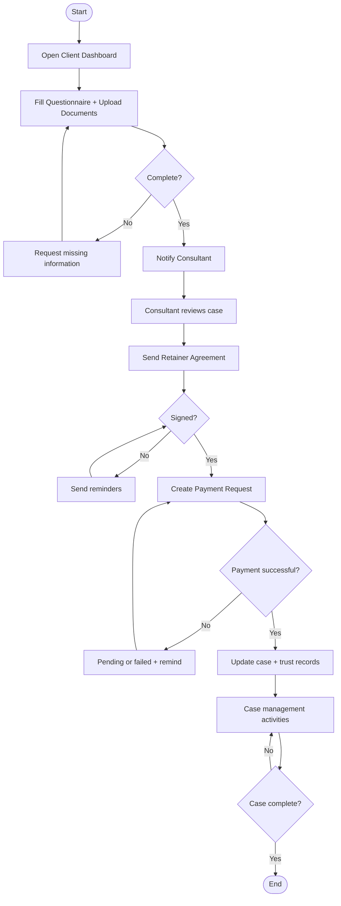
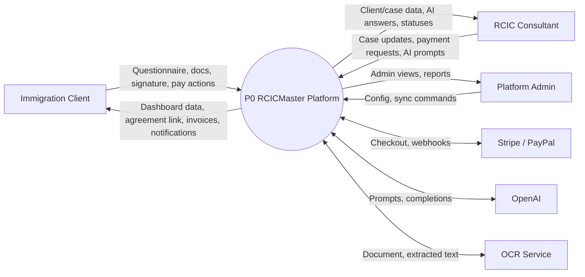

# RCICMaster (WayToCanada) — Activity Diagrams & DFD Prompt

Copy **everything below the line** into ChatGPT (or Claude / Gemini) to generate professional **Activity Diagrams** and **Data Flow Diagrams (DFD)**.

This is a **Behavioral / Process UML + Structured Analysis** set — step-by-step process logic and data movement.

---

CHATGPT PROMPT (copy everything below the line to ChatGPT):
================================================================================
Create a complete set of professional **Activity Diagrams** and **Data Flow Diagrams (DFD)** for **RCICMaster** (WayToCanada) — a Canadian immigration consultant (RCIC) practice management platform.

## Purpose

1. **Activity Diagrams** — show step-by-step logic/flow of specific processes (decisions, parallel paths, start/end).
2. **Data Flow Diagrams (DFD)** — show how data moves between external entities, processes, and data stores (Level 0 + Level 1).

Do NOT replace these with a class diagram or system architecture poster.  
Do NOT invent a POS / inventory system.

## Output requirements

1. Produce **separate diagrams** with clear titles.
2. Activity diagrams: UML activity notation (initial/final nodes, actions, decisions, guards, forks/joins if needed).
3. DFDs: Yourdon/DeMarco or Gane–Sarson style:
   - External entity = rectangle
   - Process = rounded rectangle / circle with number
   - Data store = open rectangle (D1, D2, …)
   - Data flow arrows with labeled data names
4. Prefer **Mermaid** (`flowchart` for activities; `flowchart` for DFD layout) and/or PlantUML activity diagrams.
5. Include legends + short narratives.
6. Accuracy: use RCICMaster concepts (cases, questionnaire, retainer, payments, Maple AI, OCR, LMS, legislation sync).

---

# PART A — ACTIVITY DIAGRAMS (mandatory)

Generate these activity diagrams:

## AD-01 — User Authentication Activity

Show:
- Start → Enter credentials / choose OAuth
- Decision: OAuth or password?
- Validate credentials / complete OAuth
- Decision: Valid?
  - No → Show error → End (or retry loop)
  - Yes → Issue Sanctum token
- Decision: Role?
  - Client → Client dashboard
  - RCIC → Consultant dashboard (opt: licence verified?)
  - Admin → Admin dashboard
- End

## AD-02 — Core Case Process Activity (Main business workflow)

End-to-end client↔consultant case flow:

1. Start: Client registered & logged in
2. Choose / request consultant
3. Fill questionnaire
4. Upload documents
5. Decision: Complete?
   - No → request missing info
   - Yes → notify consultant
6. Consultant reviews documents (opt OCR)
7. Assign / refine immigration pathway (opt Maple AI / CRS assist)
8. Send retainer agreement
9. Decision: Signed?
   - No → reminders → wait
   - Yes → continue
10. Create payment request / collect fee
11. Decision: Payment success?
    - No → pending/failed + reminder
    - Yes → update trust/payment records
12. Active case management (messages, meetings, IRCC forms, LMS)
13. Decision: Case complete?
14. Close / complete case → End

Use decision diamonds with Yes/No guards.  
Optional swimlanes: **Client | Consultant | System** (preferred if readable).

## AD-03 — Payment Checkout + Webhook Activity

- Start: Payment request created
- Client opens checkout
- Redirect to Stripe/PayPal
- Client pays
- Webhook received
- Decision: Signature valid & event success?
  - No → log failure / keep pending
  - Yes → update DB (payment, invoice/milestone, trust ledger)
- Queue notifications (email/WhatsApp/in-app)
- Show confirmation on dashboard → End

## AD-04 — Document Upload + OCR Activity

- Start: Client selects document
- Validate file type/size
- Decision: Valid file?
- Store in S3 + save `DocumentSubmission`
- Decision: OCR enabled?
  - Yes → call OCR service → decision OCR OK? → save extracted text / else save without text
  - No → skip OCR
- Notify consultant → End

## AD-05 — Maple AI Advisory Activity (optional but recommended)

- Start: Consultant submits question
- Load case/client context
- Decision: AI enabled?
  - No → rules fallback response
  - Yes → call OpenAI → save chat/advisory → show answer
- End

---

### Activity Mermaid template (expand fully per AD)

---

# PART B — DATA FLOW DIAGRAMS (mandatory)

## DFD Level 0 — Context Diagram

One process only: **P0: RCICMaster Platform**

External entities:
- Immigration Client
- RCIC Consultant
- Platform Admin
- Stripe / PayPal
- OpenAI
- OCR Service
- Email (SES) / WhatsApp
- Meeting Providers
- Public Visitor (optional)

Show major data flows in/out, for example:
- Client → P0: questionnaire data, documents, signature, payment confirmation actions
- P0 → Client: dashboard data, agreement PDF/link, invoices, notifications, meeting links
- Consultant → P0: case updates, pathway, payment requests, AI prompts, meeting schedules
- P0 → Consultant: client lists, OCR results, AI responses, payment statuses
- Admin → P0: config, package/gateway settings, sync commands
- P0 ↔ Stripe/PayPal: checkout session / webhooks
- P0 ↔ OpenAI: prompts / completions
- P0 ↔ OCR: document image / extracted text
- P0 → SES/WhatsApp: notification messages

## DFD Level 1 — Decompose P0 into main processes

Suggested processes (number them):

| ID | Process |
|---|---|
| 1.0 | Authenticate & Authorize Users |
| 2.0 | Manage Client Questionnaire & Documents |
| 3.0 | Manage Cases & Retainer Agreements |
| 4.0 | Process Payments & Trust Accounting |
| 5.0 | Notify Users (in-app / email / WhatsApp) |
| 6.0 | Maple AI & Letter Assistance |
| 7.0 | Manage LMS Learning |
| 8.0 | Legislation / IRCC / CRS Sync & Search |
| 9.0 | Schedule Meetings |

Data stores:

| ID | Store | Contents |
|---|---|---|
| D1 | Users & Roles DB (`db_cws`) | users, roles/permissions, tokens |
| D2 | Cases & Documents Store (`db_cws` + S3) | client profiles, case files, questionnaire, document metadata + files |
| D3 | Payments & Trust Store (`db_cws`) | subscriptions, payment requests, milestones, invoices, trust ledger |
| D4 | Notifications Store (`db_cws`) | notifications, deliveries, preferences, WhatsApp threads |
| D5 | LMS Store (`db_lms`) | courses, modules, lessons, assignments, attempts |
| D6 | Legislation Store (`db_legal`) | legislation documents, provisions, references |
| D7 | Integration Settings (`db_cws`) | gateway/integration settings |

Wire realistic labeled flows, examples:
- Client → 2.0: QuestionnaireSubmission / Document file
- 2.0 → D2: save submission; 2.0 → OCR → extracted text → D2
- 3.0 → Client: agreement token link; Client → 3.0: signature
- 4.0 ↔ Stripe: checkout + webhook; 4.0 → D3: payment status
- 6.0 ↔ OpenAI; 6.0 → D2/D4 as needed
- 8.0 reads/writes D6; Admin triggers sync
- 7.0 reads/writes D5; Consultant assigns course; Client completes lessons

## Optional DFD Level 2 (one deep-dive only)

Decompose **4.0 Process Payments & Trust Accounting** further:
- 4.1 Create Payment Request
- 4.2 Start Checkout Session
- 4.3 Handle Provider Webhook
- 4.4 Update Trust Ledger / Milestone Invoice
- 4.5 Trigger Payment Notifications

---

### DFD Mermaid template (Level 0 example — expand)

Create full Level 0, Level 1, and optional Level 2 diagrams.

---

## Legend

**Activity diagrams**
- Rounded rectangle = action
- Diamond = decision
- Black circle = start; bullseye = end
- Swimlane = responsible actor/system

**DFD**
- Rectangle = external entity
- Circle/rounded process = process
- Open rectangle = data store
- Arrow label = data in motion (not control flow)

## Notes under diagrams

1. Activity diagrams emphasize **control/logic**; DFDs emphasize **data movement**.  
2. Core business process centers on questionnaire → documents → retainer → payment → case management.  
3. Data is split across `db_cws`, `db_lms`, `db_legal`, plus S3 for files.  
4. External payment/AI/OCR systems exchange data through the Laravel API processes.

## Style

- Clean academic documentation look
- Number processes and data stores consistently
- Avoid mixing UML class boxes into DFDs
- If crowded, output Level 1 as two panels (Client/Case/Payment vs LMS/Legislation/AI)

Now generate:
1) All Activity Diagrams (AD-01 … AD-05) with complete Mermaid/PlantUML  
2) DFD Level 0, Level 1, and optional Level 2  
plus a short explanation of how Activity vs DFD views complement each other.
================================================================================
