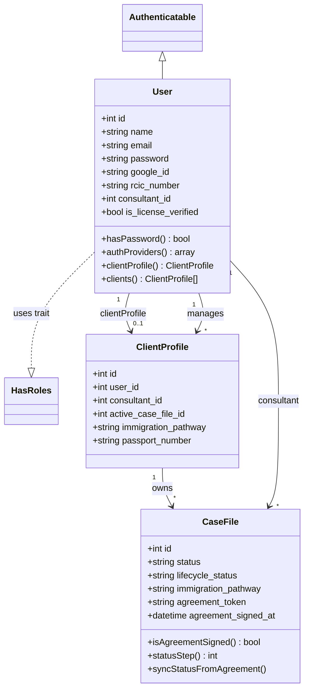

# RCICMaster (WayToCanada) — UML Class Diagram Prompt

Copy **everything below the line** into ChatGPT (or Claude / Gemini) to generate a professional **UML Class Diagram** showing OOP structure (classes, attributes, methods, relationships / inheritance).

This is a **Structural UML Design** diagram — not an ERD, not an architecture diagram, and not a system flow chart.

---

CHATGPT PROMPT (copy everything below this line to ChatGPT):
================================================================================
Create a complete, professional **UML Class Diagram** for **RCICMaster** (WayToCanada) — a Canadian immigration consultant (RCIC) practice management platform.

## Purpose

Show the system’s **object-oriented structure**:
- Classes
- Key attributes
- Important methods / operations
- Relationships (association, aggregation/composition where useful, inheritance/generalization, dependency)
- Multiplicity (1, 0..1, 1..*, * )

This is for **Structural Diagrams (UML Design)** documentation — academic / technical design quality.

## Output requirements

1. Use standard **UML Class Diagram** notation.
2. Prefer output as **Mermaid `classDiagram`** (complete, ready to render). Also acceptable: PlantUML.
3. Show **compartments** for each class:
   - Class name
   - Attributes (type + visibility: `+` public, `-` private, `#` protected)
   - Methods (signature-style, important ones only)
4. Draw relationships with labels + multiplicity.
5. Group classes into **colored packages / namespaces** by domain (see below).
6. Title: **RCICMaster — UML Class Diagram (Core Domain)**
7. Landscape layout; readable on one large poster (or 2 linked diagrams if needed: Core + Extended).
8. Keep it readable: prioritize ~45–60 most important classes (listed below). Do **not** dump every Eloquent helper.

## OOP / UML rules to follow

- **Inheritance / Generalization:**
  - Most domain entities extend Laravel `Model` (show once as a base note or show `User` specializing `Authenticatable`).
  - `User` extends `Authenticatable` and implements `MustVerifyEmail`.
  - Spatie `HasRoles` is a **trait** on `User` (show as `<<trait>> HasRoles` usage, not fake inheritance).
- **Association:** normal solid links (User–CaseFile, etc.).
- **Composition / Aggregation (optional but preferred where clear):**
  - CaseFile *composed of* CaseMessage / DocumentSubmission / CaseFeeMilestone (strong ownership).
  - LmsCourse composed of LmsModule → LmsLesson.
  - LegislationDocument composed of LegislationProvision / LegislationReference.
- **Dependency (dashed):** Services depending on Models (show a small Service layer package).
- **Polymorphism note:** `UserNotification` uses **morphTo `related`** (polymorphic association).
- Mark database connection differences:
  - Default / `cws` models
  - `<<lms>>` stereotype for LMS models (`db_lms`)
  - Legislation corpus conceptually in `db_legal` (same Eloquent models, note on package)

## Tech context (short)

- Backend domain models: **Laravel Eloquent** (PHP)
- Auth: Sanctum tokens + Spatie roles (`super-admin`, `admin`, `rcic`, `client`)
- Almost no SoftDeletes in domain models
- Cross-DB note: `LmsCourseAssignment.client_user_id` references `users.id` logically (no physical FK)

---

## PACKAGES / DOMAINS TO DRAW

### Package 1 — Users & Auth
Classes:
- **User**
  - Attributes: `id`, `name`, `email`, `phone`, `password`, `google_id`, `github_id`, `rcic_number`, `is_license_verified`, `consultant_id`, `company_name`, `digital_signature`, …
  - Methods: `+hasPassword(): bool`, `+authProviders(): array`, `+clientProfile()`, `+clients()`
  - Traits/roles: `HasApiTokens`, `HasRoles`, `Notifiable`
  - Extends: `Authenticatable`
- **Role** (Spatie) — roles: super-admin, admin, rcic, client
- **RcicConsultant** (CICC registry cache) — scopes: `active()`, `search()`
- **ImmigrationConsultant**
- **ConsultantClientRequest**
  - Methods: `+isPending(): bool`

Relationships:
- User `1` — `0..1` ClientProfile
- User `1` — `*` ClientProfile (as consultant managing clients)
- User `*` — `*` Role (via Spatie pivots)
- ConsultantClientRequest → User (client) + User (consultant)

### Package 2 — Clients & Cases (CORE — draw in center)
Classes:
- **ClientProfile**
  - Attributes: `user_id`, `consultant_id`, `active_case_file_id`, `phone`, `passport_number`, `immigration_pathway`, `family_id`, `notes`, `invited_at`
  - Methods: `+scopeForConsultant(...)`
- **CaseFile**
  - Attributes: `status`, `lifecycle_status`, `immigration_pathway`, `pathway_assessment_snapshot`, `assigned_ircc_category_id`, `agreement_token`, `agreement_signed_at`, `checklist_data`, `agreement_fee`, `agreement_config`
  - Methods: `+isAgreementSigned(): bool`, `+statusStep(): int`, `+statusOrder()`, `+syncStatusFromAgreement()`, `+effectiveStatusStep()`
- **CaseMessage**
  - Attributes: `sender_id`, `sender_type`, `message`, `document_submission_id`, `read_at`
- **ClientActivityLog**
- **ConsultantAgreementTemplate**
  - Attributes: `consultant_id`, `name`, `pathway`, `config`, `is_default`

Relationships:
- ClientProfile `1` — `*` CaseFile
- ClientProfile `0..1` — `1` CaseFile (active case via `active_case_file_id`)
- CaseFile `*` — `1` User (consultant)
- CaseFile `1` — `*` CaseMessage
- CaseFile `0..1` — `1` IrccCategory (assigned)

### Package 3 — Questionnaires & Documents
Classes:
- **QuestionnaireSubmission**
  - Attributes: `user_id`, `step1_data`, `main_data`, `spouse_data`, `children_data`, `accompanying_data`, `verified_fields`, `field_remarks`, `is_submitted`
- **DocumentSubmission**
  - Attributes: `case_file_id`, `uploaded_by`, `document_type`, `file_path`, `status`, `ai_result`, `ai_confidence`, `reviewed_by`
  - Methods / accessors: `+getFileUrlAttribute()` / `file_url`
- **IrccPackageDocumentSubmission**

Relationships:
- User `1` — `*` QuestionnaireSubmission
- CaseFile `1` — `*` DocumentSubmission
- DocumentSubmission → User (uploader, reviewer)

### Package 4 — Payments, Subscriptions & Trust
Classes:
- **SubscriptionPackage**
- **ConsultantSubscription** — method: `+isCurrentlyActive(): bool`
- **SubscriptionPaymentRecord**
- **ConsultantPaymentAccount** — methods: `+hasStripe()`, `+hasPaypal()`, `+hasInterac()`, `+isReadyFor()`
- **ClientPaymentRequest** — methods: `+publicUrl()`, `+isPayable()`
- **ClientTrustAccount**
- **TrustLedgerEntry**
- **CaseFeeMilestone**
- **MilestoneInvoice**
- **PaymentGatewaySetting** — methods: `+encryptKey()`, `+decryptKey()`, `+maskKey()`
- **GstHstRateVersion** (optional leaf)

Relationships:
- User `1` — `*` ConsultantSubscription → SubscriptionPackage
- ConsultantSubscription `1` — `*` SubscriptionPaymentRecord
- CaseFile `1` — `0..1` ClientTrustAccount
- ClientTrustAccount `1` — `*` TrustLedgerEntry
- CaseFile `1` — `*` CaseFeeMilestone `1` — `*` MilestoneInvoice
- ClientPaymentRequest → CaseFile, ClientProfile, User(consultant)

### Package 5 — Meetings & Notifications
Classes:
- **ClientMeeting** — methods: `+publicUrl()`, `+googleCalendarUrl()`
- **ConsultantMeetingAccount** — method: `+meetingUrlFor()`
- **UserNotification** — method: `+isUnread(): bool` ; polymorphic `related`
- **NotificationDelivery**
- **UserNotificationPreference**
- **WhatsAppConversation** — method: `+hasOpenSession()`
- **WhatsAppMessage**

Relationships:
- CaseFile / ClientProfile / User → ClientMeeting
- User `1` — `*` UserNotification `1` — `*` NotificationDelivery
- UserNotification ◆‥ morph related (CaseFile / Payment / Meeting / etc.)
- WhatsAppConversation `1` — `*` WhatsAppMessage

### Package 6 — IRCC / CRS / Legislation
Classes:
- **IrccCategory** — methods: `+breadcrumb()`, self-relation parent/children
- **IrccCategoryDocument**
- **IrccInteractiveForm**
- **IrccInteractiveFormResponse** — method: `+isSubmitted()`
- **CrsRuleVersion** — static `+active()`
- **ExpressEntryDraw**
- **LegislationDocument**
- **LegislationProvision**
- **LegislationReference**
- **LegislationSyncRun** — method: `+progressPercent()`
- **LegislationAmendmentAlert**
- **ConsultantLegislationBookmark**

Relationships:
- IrccCategory self-tree; hasMany documents / interactive forms
- IrccInteractiveFormResponse → IrccInteractiveForm, CaseFile, User
- LegislationDocument `1` — `*` LegislationProvision
- LegislationDocument `1` — `*` LegislationReference
- LegislationDocument optional pair link (`paired_document_id`)

### Package 7 — LMS `<<lms>>` (db_lms)
Classes (collapse question-bank detail if crowded):
- **LmsCategory**
- **LmsCourse**
- **LmsModule**
- **LmsLesson**
- **LmsQuiz**
- **LmsQuestion** / **LmsQuestionOption** (can nest or summarize)
- **LmsHomework**
- **LmsCourseAssignment**
- **LmsLessonCompletion**
- **LmsQuizAttempt**
- **LmsHomeworkSubmission**

Relationships:
- LmsCategory `1` — `*` LmsCourse
- LmsCourse `1` — `*` LmsModule `1` — `*` LmsLesson
- LmsCourse `1` — `*` LmsQuiz / LmsHomework / LmsCourseAssignment
- LmsCourseAssignment → User (client_user_id, cross-DB logical)
- Assignment `1` — `*` LessonCompletion / QuizAttempt

### Package 8 — Maple AI & Letters
Classes:
- **ConsultantClientAiChatMessage**
- **ConsultantClientAiDocument**
- **ConsultantClientAiAdvisory**
- **ConsultantLetterTemplate**
- **ConsultantLetter**

Relationships:
- Each AI/Letter entity → User(consultant) + ClientProfile
- ConsultantLetterTemplate `1` — `*` ConsultantLetter

### Package 9 — Community, Support, Marketing & Storage
Classes:
- **RcicCommunityPost** / **RcicCommunityReply** / **RcicCommunityReaction** / **RcicCommunityReport**
- **SupportTicket** — method: `+isOpen()` ; **SupportTicketMessage**
- **MarketingService** / **ConsultantMarketingOrder**
- **StorageAddonPackage** / **ConsultantStorageAddon** — method: `+isActive()` / `+extraBytes()`
- **ConsultantStorageFolder** (self parent/children) / **ConsultantStorageFile**
- **IntegrationSetting** / **PlatformCompanySetting** (optional)

### Package 10 — Services (dependency layer — methods only / no DB attrs)
Show as `<<service>>` classes with dependencies (dashed) to core models:
- `CaseFileLifecycleService`
- `StripePaymentFulfillmentService` / `ClientPaymentRequestService`
- `WorkspaceMapleCaseChatService` / `WorkspaceMaplePathwayAdvisorService`
- `ConsultantLetterGenerationService`
- `LegislationSyncService`
- `CrsScoringService`
- `LmsProgressService`
- `NotificationOrchestrator`
- `ClientMeetingService`
- `ConsultantStorageService`

Also optional:
- Jobs: `DeliverNotificationChannelsJob`, `RunLegislationSyncJob`
- Middleware: `EnsureHasRole`

---

## Suggested Mermaid structure (EXPAND FULLY — do not leave as stub)

Complete the diagram with all packages, key attributes, methods, and multiplicities.

---

## Relationship legend (include under diagram)

- Solid line + multiplicity = association  
- Hollow triangle arrow = inheritance / generalization  
- Filled/strong diamond = composition (optional)  
- Dashed arrow = dependency (services → models)  
- `<<trait>>` / `<<service>>` / `<<lms>>` = stereotypes  
- Morph label = polymorphic association  

## Design notes to print under the diagram

1. Domain is modeled primarily as **Eloquent entity classes** with rich relationships.  
2. **User** is the central identity class; role differences use Spatie roles rather than deep inheritance trees.  
3. **CaseFile** is the aggregate root for case messaging, documents, trust, milestones, and meetings.  
4. LMS classes live on a separate DB connection (`db_lms`) and link to users logically.  
5. Services encapsulate use-cases (payments, Maple AI, legislation sync, LMS progress) and depend on model classes.

## Style

- Clean UML academic/professional look
- Package boundaries clearly labeled
- Core Clients & Cases package visually centered
- Avoid overcrowding attributes — show the most important 4–8 attrs + key methods per class
- If too large for one canvas, produce:
  - Diagram A: Users + Clients/Cases + Documents + Payments/Trust
  - Diagram B: IRCC/Legislation + LMS + AI/Letters + Notifications/Community

Now generate the **full UML Class Diagram** (complete Mermaid `classDiagram` code) plus a short OOP design narrative (how inheritance, associations, and service dependencies are used).
================================================================================
