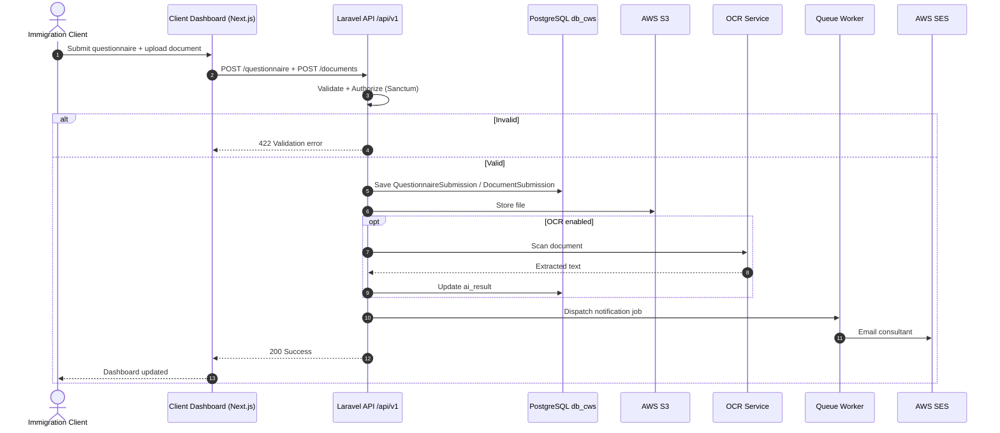

# RCICMaster (WayToCanada) — UML Sequence Diagrams Prompt

Copy **everything below the line** into ChatGPT (or Claude / Gemini) to generate professional **UML Sequence Diagrams** for key workflows.

This is a **Behavioral UML Design** diagram set — message passing between components over time.

---

CHATGPT PROMPT (copy everything below this line to ChatGPT):
================================================================================
Create a complete set of professional **UML Sequence Diagrams** for **RCICMaster** (WayToCanada) — a Canadian immigration consultant (RCIC) practice management platform.

## Purpose

Show how **components exchange messages** during key workflows / features (authentication + main core processes).

This is NOT a use case diagram, class diagram, or architecture poster. Focus on **time-ordered interactions**.

## Output requirements

1. Produce **multiple sequence diagrams** (one per workflow below). Do not merge everything into one unreadable diagram.
2. Use standard UML sequence notation:
   - Lifelines (participants)
   - Synchronous calls (solid arrow)
   - Returns (dashed arrow)
   - Optional: async/webhook messages (dashed or labeled «async»)
   - Alt / opt / loop fragments for decisions and retries
3. Prefer **Mermaid `sequenceDiagram`** (complete, renderable) for each workflow. PlantUML is also acceptable.
4. Title each diagram clearly, e.g. **SD-01: User Authentication**
5. Keep participants realistic for RCICMaster (see participant list).
6. Include short notes under each diagram explaining the happy path + failure path.
7. Accuracy rules:
   - DO NOT invent POS/cashier flows
   - Use Laravel API `/api/v1`, Sanctum bearer tokens, Next.js frontends, PostgreSQL, S3, Stripe/PayPal webhooks, OpenAI, OCR FastAPI
   - Prefer real service names where helpful (or generic “Laravel API” if simplifying)

---

## Common participants (reuse across diagrams)

| Lifeline | Meaning |
|---|---|
| ClientBrowser / ConsultantBrowser / AdminBrowser | Next.js frontend |
| FlutterApp | Mobile client (optional in some SDs) |
| Nginx | TLS reverse proxy (optional; can omit if crowded) |
| LaravelAPI | Backend `/api/v1` |
| Sanctum / AuthService | Authentication / token issuance |
| DB_CWS | PostgreSQL `db_cws` |
| DB_LMS | PostgreSQL `db_lms` (LMS only) |
| DB_LEGAL | PostgreSQL `db_legal` (legislation only) |
| S3 | AWS S3 document storage |
| Stripe / PayPal | Payment providers |
| OpenAI | Maple AI / letters / legislation assist |
| OCRService | FastAPI EasyOCR `:8001` |
| SES | AWS SES email |
| WhatsAppAPI | Meta / Twilio WhatsApp |
| QueueWorker | Laravel database queue worker |
| Scheduler | Laravel scheduler / cron |

---

## SEQUENCE DIAGRAMS TO GENERATE (mandatory)

### SD-01 — User Authentication (Email/Password + optional OAuth)

**Goal:** User logs in and receives a Sanctum token, then accesses role dashboard.

Participants: Browser, LaravelAPI, Auth/Sanctum, GoogleOAuth (opt), DB_CWS

Flow:
1. User submits login (email/password) OR clicks Google/GitHub OAuth
2. API validates credentials OR completes OAuth callback
3. `alt` invalid → 401 / error response
4. `alt` valid → create/find user, issue Sanctum personal access token
5. Return token + user/role payload
6. Frontend stores token and navigates to Client / Consultant / Admin dashboard
7. Subsequent API calls send `Authorization: Bearer <token>`

Include `opt` fragment for email verification / licence verification gates for consultants if relevant.

---

### SD-02 — Core Feature: Client Questionnaire + Document Upload (+ OCR)

**Goal:** Client submits questionnaire and uploads documents for a case.

Participants: ClientBrowser, LaravelAPI, DB_CWS, S3, OCRService, QueueWorker, SES/WhatsApp (notify)

Flow:
1. Client opens questionnaire in Client Dashboard
2. Browser → API: save questionnaire steps (`QuestionnaireSubmission`)
3. API validates → write DB_CWS
4. Client uploads document
5. API stores file metadata + puts file in S3
6. `opt` OCR requested:
   - API → OCRService scan
   - OCR returns extracted text
   - API saves AI/OCR result on `DocumentSubmission`
7. API notifies consultant (queue job → SES / WhatsApp / in-app notification)
8. Return success to client dashboard

`alt` validation failure / OCR failure with fallback (save file without OCR text).

---

### SD-03 — Core Feature: Retainer Agreement Send → Sign

**Goal:** Consultant sends retainer; client signs via secure token link.

Participants: ConsultantBrowser, ClientBrowser, LaravelAPI, DB_CWS, SES, QueueWorker, Scheduler (reminders)

Flow:
1. Consultant configures/sends agreement for `CaseFile`
2. API generates `agreement_token`, stores agreement config/fee on CaseFile, status → agreement sent
3. API emails secure link to client (SES) + in-app notification
4. Client opens `/agreement/{token}`
5. API verifies token
6. `alt` invalid/expired → error
7. Client reviews and signs
8. API stores `agreement_signed_at` (+ IP/user agent), advances case status
9. Notify consultant of signature
10. `opt` if not signed: Scheduler reminder command → SES/WhatsApp reminders

---

### SD-04 — Core Feature: Client Payment (Checkout + Webhook)

**Goal:** Client pays a payment request; webhook finalizes records.

Participants: ClientBrowser, LaravelAPI, Stripe (or PayPal), DB_CWS, QueueWorker, SES/WhatsApp

Flow:
1. Consultant creates `ClientPaymentRequest` (or milestone invoice path)
2. Client opens pay link / billing page
3. API creates Stripe Checkout Session (or PayPal order)
4. Client completes payment on Stripe/PayPal
5. Provider sends **webhook** to LaravelAPI
6. API verifies signature/event
7. `alt` success:
   - Update payment request / subscription / trust ledger / milestone invoice status
   - Queue notification job
   - Return/ack 200 to webhook
8. `alt` failure/pending:
   - Keep pending/failed status
   - Optional reminder later via Scheduler
9. Client refreshes dashboard → sees paid confirmation

Show webhook as asynchronous message from Stripe → LaravelAPI.

---

### SD-05 — Maple AI Advisor (Consultant Workspace)

**Goal:** Consultant asks Maple AI about a client/case and gets advice.

Participants: ConsultantBrowser, LaravelAPI, DB_CWS, (opt DB_LEGAL), OpenAI

Flow:
1. Consultant opens Maple workspace for a client
2. Browser → API: chat/advisory request with case context
3. API loads ClientProfile / CaseFile / relevant docs metadata from DB_CWS
4. `opt` legislation context from DB_LEGAL
5. API → OpenAI Chat Completions
6. `alt` OpenAI disabled/error → rules/fallback response
7. API stores chat/advisory record (`ConsultantClientAiChatMessage` / `ConsultantClientAiAdvisory`)
8. Return answer to Consultant UI

---

### SD-06 — Meeting Schedule + Reminder (optional but recommended)

Participants: ConsultantBrowser, ClientBrowser, LaravelAPI, MeetingProvider (Google/Zoom/Teams), DB_CWS, Scheduler, SES/WhatsApp

Flow:
1. Consultant schedules `ClientMeeting`
2. API may create provider meeting link via OAuth-connected account
3. Save meeting in DB_CWS; notify client
4. Scheduler every 15 minutes runs meeting reminders
5. Send reminder notifications before meeting
6. Client attends via meeting URL

---

## Mermaid template (expand per SD — do not leave stubby)

Create similarly complete diagrams for SD-01 … SD-06.

---

## Legend (once at the end)

- Solid arrow = synchronous request  
- Dashed arrow = response / async webhook  
- `alt` = conditional paths  
- `opt` = optional step  
- `loop` = repeated reminders / retries  

## Style

- Clean UML sequence look
- Autonumber messages
- Max ~12–18 messages per diagram (readable)
- Name endpoints in business language + light technical detail (`POST /api/v1/...` ok)

Now generate **all required Sequence Diagrams** with complete Mermaid code for each, plus a short summary table of which diagram covers which feature.
================================================================================
