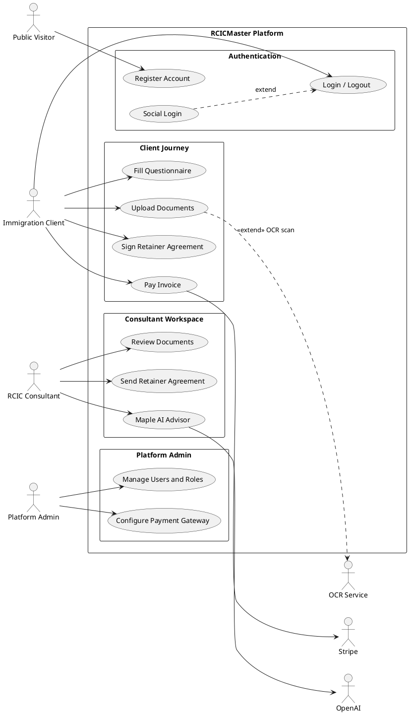

# RCICMaster (WayToCanada) — UML Use Case Diagram Prompt

Copy **everything below the line** into ChatGPT (or Claude / Gemini) to generate a professional **UML Use Case Diagram**.

This is a **Behavioral UML Design** diagram — actors and their interactions with the system.

---

CHATGPT PROMPT (copy everything below this line to ChatGPT):
================================================================================
Create a complete, professional **UML Use Case Diagram** for **RCICMaster** (WayToCanada) — a Canadian immigration consultant (RCIC) practice management platform.

## Purpose

Show **system actors** (users / admins / external systems) and their **interactions (use cases)** with the RCICMaster platform.

This is NOT a class diagram, sequence diagram, architecture diagram, or flow chart.

## Output requirements

1. Use standard **UML Use Case** notation:
   - Stick-figure (or labeled actor) shapes for actors
   - Ovals for use cases
   - System boundary box titled **RCICMaster / WayToCanada Platform**
   - Association lines actor → use case
   - «include» and «extend» where appropriate
2. Prefer output as **Mermaid** (`flowchart` or `C4` style use-case layout) **AND/OR** PlantUML `@startuml` use case syntax.
3. Group use cases inside the system boundary into packages:
   - Authentication
   - Public Services
   - Client Journey
   - Consultant Workspace
   - Legislation Hub
   - Platform Admin
4. Color-code:
   - Primary actors (humans) — light blue
   - Secondary / supporting actors (external systems) — gray / green
   - Use cases — yellow / cream ovals
5. Title: **RCICMaster — UML Use Case Diagram**
6. Landscape poster layout; readable for documentation / thesis / onboarding.
7. Include a short legend + 1-paragraph narrative under the diagram.

## IMPORTANT accuracy rules

- Use ONLY the actors and use cases listed below (RCICMaster immigration platform).
- DO NOT invent a POS / billing-shop / inventory system.
- DO NOT invent fake actors like Cashier / Stock Keeper.
- Roles are Spatie-based: `client`, `rcic` (consultant), `admin`, `super-admin` — but show human actors as business roles below.
- External systems are supporting actors (secondary).

---

## ACTORS

### Primary actors (human)
| Actor | Description |
|---|---|
| **Public Visitor (Guest)** | Unauthenticated visitor browsing public pages |
| **Immigration Client** | Applicant using client dashboard / mobile |
| **RCIC Consultant** | Licensed immigration consultant using consultant workspace |
| **Platform Admin** | Platform operator (admin / super-admin dashboards) |

### Supporting actors (external systems)
| Actor | Description |
|---|---|
| **Stripe** | Payments, subscriptions, Connect, webhooks |
| **PayPal** | Alternate payments / subscriptions |
| **Google OAuth** | Social login (+ Meet/Calendar where relevant) |
| **GitHub OAuth** | Social login |
| **OpenAI** | Maple AI advisor, letter assist, legislation explain |
| **OCR Service** | FastAPI + EasyOCR document scanning |
| **AWS SES** | Transactional email |
| **WhatsApp API** | Meta Cloud API / Twilio WhatsApp messaging |
| **Meeting Providers** | Google Meet / Zoom / Microsoft Teams |

(You may show the most important supporting actors on the diagram; list the rest in a note if crowded.)

---

## USE CASES (must include)

### Package: Authentication
- Register Account
- Login / Logout
- Reset Password
- Verify Email
- Social Login (Google / GitHub)
- Consultant Onboarding (licence / CICC verification path)

### Package: Public Services
- Browse IRCC News
- Use CRS Calculator
- Browse Subscription Plans
- View Consultant Marketing Website

### Package: Client Journey
- Choose / Request Consultant
- Fill Immigration Questionnaire
- Upload Documents
- Sign Retainer Agreement
- View My Pathway
- Message Consultant
- Attend Meeting
- Pay Invoice / Payment Request
- View Trust Account
- Complete LMS Course
- Fill IRCC Interactive Forms
- Receive Notifications (in-app / email / WhatsApp)

### Package: Consultant Workspace
- Manage Clients / Case Pipeline
- Assign Immigration Pathway
- Review Documents (incl. OCR assist)
- Send Retainer Agreement
- Schedule Meeting
- Create Payment Request
- Manage Trust Ledger / Milestones
- Generate Letters (AI-assisted)
- Use Maple AI Advisor
- Assign LMS Courses
- Search / Bookmark Legislation
- AI Explain Legislation
- Export Compliance Packet
- Manage Storage / Marketing Orders (optional if space)

### Package: Platform Admin
- Manage Users and Roles
- Configure Payment Gateway
- Manage Subscription Packages
- Manage LMS Content
- Sync Legislation / IRCC / CRS / GST-HST data
- WhatsApp Inbox / Support Tickets
- Manage Integrations
- Platform Analytics / Settings

---

## Associations (who uses what)

Wire these clearly:

**Guest →** Register Account; Browse IRCC News; CRS Calculator; Browse Subscription Plans; View Consultant Website

**Immigration Client →** Login/Logout; Choose Consultant; Fill Questionnaire; Upload Documents; Sign Retainer; View Pathway; Message Consultant; Attend Meeting; Pay Invoice; View Trust Account; Complete LMS; Fill IRCC Forms; Receive Notifications

**RCIC Consultant →** Login/Logout; Consultant Onboarding; Manage Clients/Case Pipeline; Assign Pathway; Review Documents; Send Agreement; Schedule Meeting; Create Payment Request; Manage Trust Ledger; Generate Letters; Maple AI Advisor; Assign LMS; Legislation search/bookmark/AI explain; Export Compliance Packet

**Platform Admin →** Login/Logout; Manage Users/Roles; Configure Payment Gateway; Manage Packages; Manage LMS; Sync Legislation/IRCC/CRS/GST-HST; WhatsApp Inbox/Support; Manage Integrations; Analytics/Settings

**Supporting actor links (examples):**
- Social Login «include»/associates with Google OAuth / GitHub OAuth
- Pay Invoice / Create Payment Request / Configure Gateway associate with Stripe / PayPal
- Upload Documents / Review Documents associate with OCR Service
- Maple AI Advisor / Generate Letters / AI Explain Legislation associate with OpenAI
- Receive Notifications / WhatsApp Inbox associate with AWS SES + WhatsApp API
- Attend Meeting / Schedule Meeting associate with Meeting Providers

---

## «include» / «extend» (add these)

Suggested «include»:
- Login «include» Authenticate User
- Pay Invoice «include» Process Payment Gateway Checkout
- Upload Documents «include» Store File in S3 (can be note instead of use case if too low-level)
- Sign Retainer «include» Verify Agreement Token
- Maple AI Advisor «include» Call OpenAI (or show OpenAI as supporting actor)

Suggested «extend»:
- Login «extend» Social Login (Google/GitHub)
- Review Documents «extend» Run OCR Scan
- Generate Letters «extend» AI Letter Assist
- Receive Notifications «extend» Send WhatsApp Message
- Pay Invoice «extend» Apply GST/HST Tax Calculation

Keep include/extend minimal and correct — do not overuse.

---

## Suggested Mermaid approach

Because Mermaid has limited native use-case shapes, use a clear flowchart with actor nodes + oval-like use case nodes inside a system subgraph, OR output PlantUML use case diagram.

PlantUML example structure (expand fully):

Expand this to include **all** use cases and actor associations listed above.

---

## Legend

- Stick actor = primary human actor  
- Gray/green actor = supporting external system  
- Oval = use case  
- Solid line = association  
- Dashed «include» / «extend» = use-case relationships  
- Large box = system boundary  

## Notes under diagram

1. Primary actors: Guest, Immigration Client, RCIC Consultant, Platform Admin.  
2. Supporting actors integrate payments, AI, OCR, email, WhatsApp, and meetings.  
3. Client journey and consultant workspace use cases form the core immigration case workflow.  
4. Admin use cases cover platform configuration, content, and sync operations.

## Style

- Clean academic UML look
- System boundary clearly labeled
- Grouped packages inside the boundary
- Avoid overcrowding lines; fan actors left/right of the boundary

Now generate the **full UML Use Case Diagram** (PlantUML and/or Mermaid) plus a short narrative of actor responsibilities.
================================================================================
